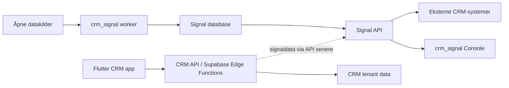

# CRM App Architecture

Dette dokumentet konkretiserer fase 2 for den brukerrettede CRM-appen i
`apps/crm-app`.

## Produktgrense

`crm-app` er operativt CRM:

- accounts/organisasjoner
- roller som prospect, customer, supplier og partner
- kontakter
- enkel pipeline
- aktiviteter og oppgaver
- notater
- signalfeed inn i daglig arbeidsflyt

`crm-app` skal ikke eie signal-logikken. Appen skal konsumere signaler fra
`crm_signal` API-et på samme måte som et eksternt CRM senere kan gjøre.



## Runtime-Retning

Første kjørbare appstruktur er Flutter med repository-interfaces og en
API-backed store mot lokal `crm-api`:

```text
Flutter UI
  -> controller / use cases
  -> CrmWorkspaceStore
  -> crm-api / Supabase Edge Functions
  -> Postgres

Flutter UI
  -> controller / use cases
  -> CrmWorkspaceStore
  -> crm-api
  -> signaldata fra Postgres i lokal dev
```

`MockCrmStore` finnes fortsatt som fallback/testkilde bak samme interface.

I prototypen kan Supabase brukes til Auth, Postgres og Storage. Privilegerte
operasjoner, som "opprett account fra signal", bør gå via API/Edge Function når
de krever validering av tenant, membership, signaltilgang eller audit.

I lokal dev ligger denne grensen i `apps/crm-api`. Den er separat fra
`apps/signal-api`, som fortsatt er signalproduktets API for Console og senere
eksterne CRM-integrasjoner.

## Datamodell

Eksisterende `organizations` forblir globalt register- og signalgrunnlag.
CRM-laget introduserer tenant-spesifikk relasjon til organisasjonen:

```text
organizations
  -> crm_accounts
       -> crm_account_roles
       -> crm_contacts
       -> crm_deals
       -> crm_activities
       -> crm_notes
       -> crm_account_signals
```

Første CRM-migrasjon ligger i
`infra/migrations/003_crm_core.sql`.

Tabellene har denne ansvarsdelingen:

- `tenants`: kunde/team som eier CRM-data.
- `crm_users`: app-profil som senere kan kobles til Supabase Auth via `auth_user_id`.
- `tenant_memberships`: brukerens rolle i tenant.
- `crm_accounts`: tenantens operative account for en global organisasjon.
- `crm_account_roles`: prospect/customer/supplier/partner osv. per account.
- `crm_contacts`: personer knyttet til en account.
- `crm_pipelines` og `crm_pipeline_stages`: enkel pipeline-konfigurasjon.
- `crm_deals`: muligheter/deals knyttet til account og pipeline-stage.
- `crm_activities`: oppgaver, møter, telefoner og andre neste handlinger.
- `crm_notes`: brukergenererte notater.
- `crm_account_signals`: tenantens status på signaler som er koblet til accounts.

## Opprett Account Fra Signal

Første ønskede flyt:

1. CRM-appen henter relevante signaler fra `crm_signal` API-et.
2. Bruker trykker "Opprett account".
3. Backend verifiserer tenant/membership og signaltilgang.
4. Backend oppretter `crm_accounts` med `source = 'signal'`.
5. Backend legger til `prospect` i `crm_account_roles`.
6. Backend oppretter `crm_account_signals` med status `acted_on`.
7. Backend skriver audit-event.
8. Flutter navigerer til ny account-detalj.

Den lokale `crm-api`-flyten dekker nå punkt 2-8. I lokal dev leser `crm-api`
signaldata direkte fra samme Postgres som worker bruker. Senere bør denne
lesingen gå via signal-API eller en tydelig intern servicekontrakt.

Lokal Postgres-dev kan seedes med:

```bash
pnpm worker dev:seed-crm-context
```

Denne kommandoen lager demo-tenant, demo-bruker, membership, pipeline/stages,
accounts, roller, kontakter, deals, aktiviteter, notater og
`crm_account_signals` basert på importerte `organizations` og eksisterende
`generated_signals`.

## Flutter-Struktur

Første appstruktur:

```text
apps/crm-app/lib/
  main.dart
  src/
    app/
      crm_app.dart
      crm_theme.dart
    crm/
      application/
        crm_repositories.dart
        crm_use_cases.dart
        crm_workspace_controller.dart
      data/
        api_crm_store.dart
        fallback_crm_store.dart
        mock_crm_store.dart
      domain/
        crm_models.dart
      presentation/
        crm_workspace_page.dart
```

`CrmWorkspacePage` snakker med `CrmWorkspaceController`. Controlleren bruker
`CrmWorkspaceStore`, som samler `CrmRepository` og `SignalRepository`.
`CreateAccountFromSignalUseCase` bruker fortsatt bare `CrmRepository`.
`ApiCrmStore` mapper `crm-api` JSON til domenemodellene, mens `MockCrmStore`
ligger bak samme interface som fallback og testkilde.

Planlagt neste struktur når appen vokser:

```text
crm/
  application/
    crm_repositories.dart
    crm_use_cases.dart
  data/
    api_crm_store.dart
    signal_api_client.dart
    supabase_crm_store.dart
  domain/
    crm_models.dart
  presentation/
    accounts/
    signals/
    pipeline/
    activities/
```

## RLS Og Tilgang

CRM-tabellene er tenant-baserte fra første migrasjon, men migrasjonen legger
ikke inn Supabase-spesifikke RLS-policyer ennå. Grunnen er at lokal Postgres
ikke har valgt Auth-kontrakt, JWT-claims eller Edge Function-grense.

Før tabellene eksponeres for Flutter via Supabase Data API må vi:

- enable RLS på alle CRM-tabeller i eksponert schema
- basere policies på `tenant_memberships`, ikke bruker-satt metadata
- la backend/Edge Functions sette tenant-kontekst for privilegerte handlinger
- skrive audit for opprettelse/endring av accounts, roller, deals og signalstatus
- bruke Storage policies eller signed URLs for vedlegg når det kommer

## Neste Tekniske Steg

- Legg Supabase Auth/RLS-migrasjon når prosjekt og auth-flyt er valgt.
- Legg ekte auth/tenant-header i `crm-api` og Flutter-klienten.
- Utvid `crm-api` med create/update for kontakter, deals, aktiviteter og notater.
- Bygg Flutter web-target for prototype.
- Legg mer eksplisitt state management hvis controlleren vokser.
